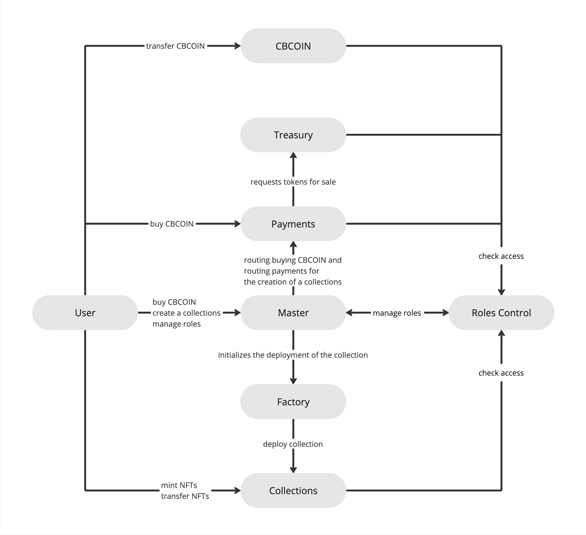

# Overview

__CheckBrand contracts__

## Architecture

Экосистема содержит следующие контракты:
* CBCOIN - контракт токена ERC-20. Основной токен платформы.
* Treasury - хранилище токенов CBCOIN для продачи через Payments.
* Payments - контракт для продажи токенов CBCOIN и оплаты создания коллекции.
* Factory - служебный контракт для развертывания коллекций.
* Master - основной контракт платформы. Используется для управления ролями и маршрутизацией вызовов.
* Collection - имплементация NFT контракта коллекции.
* ProxiedCollection - прокси контракт коллекции, разворачиваемый фабрикой. В качестве имплементации использует контракт Collection.



<div style="page-break-after: always; visibility: hidden"> 
\pagebreak 
</div>

## Structures

В данном разделе приведены интерфейсы на typescript, которые могут быть использованы в дальнейшем, а также фрагменты кода с использованием библиотеки ethers.js для взаимодействия с данными структурами.

### Signature

Используется для  подписания хешированных данных Валидитором и последющей их валидации внутри контракта.

```solidity
struct Signature {
	uint8 v;
	bytes32 r;
	bytes32 s;
}
```

```typescript
interface Signature {
	v: number,
	r: string,
	s: string
}
```

<div style="page-break-after: always; visibility: hidden"> 
\pagebreak 
</div>

### BuyTokensData

Используется для транзакции покупки CBCOIN за нативную валюту сети или любой токен. Оплатить покупку токенов сможет любой адрес, но начислены они будут на адрес `receiver`.
`paymentAmount` - сумма оплаты в нативной валюте сети или указанном токене.
`amountOfCBCOINToPurchase` - количество CBCOIN, которые будут начислены.
Таким образом, сумма оплаты не привязана к количеству начисляемых токенов, а значит, что значения могут быть заданы отдельно для различных способов оплаты.

Если оплата должна быть произведена в токенах, то в качестве `paymentToken` указывается адрес токена. А перед вызовом функции необходимо сделать `approve()` нужных токенов на контракт Master или на контракт Payments в зависимости от того, через какой контракт будет осуществляться покупка.
Если же оплата должна быть в нативной валюте сети, то указывается `ethers.constants.AddressZero`. Делать `approve()` не нужно, но нужно передать вместе с транзакцией навитвую валюту в качестве `{value: amount}`.

После чего на основе данной структуры должен быть получен хеш и подписан валидатором.

```solidity
struct BuyTokensData {
	address receiver;
	address paymentToken;
	uint256 paymentAmount;
	uint256 amountOfCBCOINToPurchase;
	uint256 deadline;
	uint256 salt;
}
```

```typescript
import { BigNumber } from "ethers";

interface BuyTokensData {
	receiver: string,
	paymentToken: string,
	paymentAmount: BigNumber,
	amountOfCBCOINToPurchase: BigNumber,
	deadline: BigNumber,
	salt: BigNumber
}
```

<div style="page-break-after: always; visibility: hidden"> 
\pagebreak 
</div>

Хеш можно посчитать локально следующим образом:
```typescript
async function calcHash(data: BuyTokensData) {
	const hash = ethers.utils.keccak256(ethers.utils.solidityPack(
		["bytes32", "bytes32"],
		[
			await payments.CACHED_DOMAIN_SEPARATOR(),
			ethers.utils.keccak256(
				ethers.utils.defaultAbiCoder.encode(
					[
						"bytes32",
						"address",
						"address",
						"uint256",
						"uint256",
						"uint256",
						"uint256"
					],
					[
						await payments.BUY_TOKENS_TYPE_HASH(),
						data.receiver,
						data.paymentToken,
						data.paymentAmount,
						data.amountOfCBCOINToPurchase,
						data.deadline,
						data.salt,
					]
				)
			)
		]
	));
	return hash;
}
```

Значения `payments.CACHED_DOMAIN_SEPARATOR()` и `payments.BUY_TOKENS_TYPE_HASH()` являются константами. Их можно сохранить локально и переиспользовать вместо того, чтобы постоянно обращаться к контракту Payments.

<div style="page-break-after: always; visibility: hidden"> 
\pagebreak 
</div>

Либо же хеш можно посчитать, обратившись к контракту:
```typescript
async function calcHash(data: BuyTokensData) {
	const hash = await payments.getBuyTokensHash(data);
	return hash;
}
```

Пример получения подписи на основе хеша:
```typescript
import { BigNumber } from "ethers";

const value = BigNumber.from(1000);

const data: BuyTokensData = {
	receiver: signer.address,
	paymentToken: ethers.constants.AddressZero,
	paymentAmount: value,
	amountOfCBCOINToPurchase: BigNumber.from(1000),
	deadline: BigNumber.from(Math.floor(Date.now() / 1000) + 10000),
	salt: BigNumber.from(1),
};

const hash = await payments.getBuyTokensHash(data);
const fullySignature = await wallet.signMessage(ethers.utils.arrayify(hash));
const splittedSignature = ethers.utils.splitSignature(fullySignature);

const signature : Signature = {
	v: splittedSignature.v,
	r: splittedSignature.r,
	s: splittedSignature.s
}
```

<div style="page-break-after: always; visibility: hidden"> 
\pagebreak 
</div>

### CreateCollectionData

```solidity
struct CreateCollectionData {
	string brandName;
	address creator;
	uint256 supplyLimit;
	uint256 paymentAmount;
	uint256 deadline;
	uint256 salt;
}
```

```typescript
import { BigNumber } from "ethers";

interface CreateCollectionData {
	brandName: string,
	creator: string,
	supplyLimit: BigNumber,
	paymentAmount: BigNumber,
	deadline: BigNumber,
	salt: BigNumber
}
```

Используется оплаты создания коллекции в токенах CBCOIN.
Использую данные, указанные в структуре, оплатить создание коллекции сможет только адрес `creator`.

После чего на основе данной структуры должен быть получен хеш и подписан валидатором.

<div style="page-break-after: always; visibility: hidden"> 
\pagebreak 
</div>

Хеш можно посчитать локально следующим образом:
```typescript
async function calcHash(data: CreateCollectionData) {
	const hash = ethers.utils.keccak256(ethers.utils.solidityPack(
		["bytes32", "bytes32"],
		[
			await payments.CACHED_DOMAIN_SEPARATOR(),
			ethers.utils.keccak256(
				ethers.utils.defaultAbiCoder.encode(
					[
						"bytes32",
						"string",
						"address",
						"uint256",
						"uint256",
						"uint256",
						"uint256"
					],
					[
						await payments.CREATE_TOLLECTION_TYPE_HASH(),
						data.brandName,
						data.creator,
						data.supplyLimit,
						data.paymentAmount,
						data.deadline,
						data.salt,
					]
				)
			)
		]
	));
	return hash;
}
```

Значение `payments.CREATE_TOLLECTION_TYPE_HASH()` является константой. Его можно сохранить локально и переиспользовать вместо того, чтобы постоянно обращаться к контракту Payments.

<div style="page-break-after: always; visibility: hidden"> 
\pagebreak 
</div>

Либо же хеш можно посчитать, обратившись к контракту:
```typescript
async function calcHash(data: CreateCollectionData) {
	const hash = await payments.getCreateCollectionHash(data);
	return hash;
}
```

Пример получения подписи на основе хеша:
```typescript
import { BigNumber } from "ethers";

const value = BigNumber.from(1000);

const data: CreateCollectionData = {
	brandName: "brandName",
	creator: signer.address,
	supplyLimit: value,
	paymentAmount: value,
	amountOfCBCOINToPurchase: BigNumber.from(1000),
	deadline: BigNumber.from(Math.floor(Date.now() / 1000) + 10000),
	salt: BigNumber.from(1),
};

const hash = await payments.getCreateCollectionHash(data);
const fullySignature = await wallet.signMessage(ethers.utils.arrayify(hash));
const splittedSignature = ethers.utils.splitSignature(fullySignature);

const signature : Signature = {
	v: splittedSignature.v,
	r: splittedSignature.r,
	s: splittedSignature.s
}
```

<div style="page-break-after: always; visibility: hidden"> 
\pagebreak 
</div>

### CollectionData

Используется для развертывания ранее созданной коллекции.
`whitelist` - root хеш, полученный на основе вайтлиста.
`bookingList` - root хеш, полученный на основе букинглиста.
`publicMintTokensLimit` - количетсво, доступное каждому адресу при PUBLIC минте.
`earnings` - суммарный процент роялти для каждого токена из коллекции. Может принимать значение от 0 до 1000 (10%).
`mintStage` - стадия минта. Может принимать значения:
* 0 (DISABLED)- минт отключен
* 1 (PUBLIC) - активен PUBLIC минт, а также доступен минт через букинглист.
* 2 (OVERALL) - активен минт через вайтлист и букинглист.

```solidity
enum MintStage { DISABLED, PUBLIC, OVERALL }

struct CollectionData {
	string name;
	string symbol;
	string baseURI;
	bytes32 whitelist;
	bytes32 bookingList;
	uint256 publicMintTokensLimit;
	uint96 earnings;
	MintStage mintStage;
}
```

```typescript
import { BigNumber } from "ethers";

interface CollectionData {
	name: string,
	symbol: string,
	baseURI: string,
	whitelist: string,
	bookingList: string,
	publicMintTokensLimit: BigNumber,
	earnings: BigNumber,
	mintStage: number
}
```

На основне данной структуры не нужно получать хеш, она просто используется в качестве одного из аргументов транзакции.

### InputRoyaltySettings

Используется для присвоения токену параметров роялти в момент минта.
Структура передается в качестве одного из аргументов в момент минта токена.
`investorFee` + `creatorsFees` всегда должны равняться параметру коллекции `earnings`.
Криэйторов у токена может не быть.

```solidity
struct InputRoyaltySettings {
	uint96 investorFee;
	address[] creators;
	uint96[] creatorsFees;
}
```

```typescript
import { BigNumber } from "ethers";

interface InputRoyaltySettings {
	investorFee: BigNumber,
	creators: string[],
	creatorsFees: BigNumber[]
}
```

<div style="page-break-after: always; visibility: hidden"> 
\pagebreak 
</div>

### InputPaymentSettings

Используется для оплаты минта токена.
Структура передается в качестве одного из аргументов в момент минта токена.
Если необходим бесплатный минт, то `paymentAmount` можно оставить пустым, а другие поля не заполнять.

Если оплата должна быть произведена в токенах, то в качестве `paymentToken` указывается адрес токена. А перед вызовом функции необходимо сделать `approve()` нужных токенов на контракт Master или на контракт Payments в зависимости от того, через какой контракт будет осуществляться покупка.
Если же оплата должна быть в нативной валюте сети, то указывается `ethers.constants.AddressZero`. Делать `approve()` не нужно, но нужно передать вместе с транзакцией навитвую валюту в качестве `{value: amount}`.

Если минт платный, то сумма `receiversShares` всегда должна равняться 10000 (100%).

```solidity
struct InputPaymentSettings {
	address paymentToken;
	uint256 paymentAmount;
	address[] paymentReceivers;
	uint96[] receiversShares;
}
```

```typescript
import { BigNumber } from "ethers";

interface InputPaymentSettings {
	paymentToken: string,
	paymentAmount: BigNumber,
	paymentReceivers: string[],
	receiversShares: BigNumber[]
}
```

<div style="page-break-after: always; visibility: hidden"> 
\pagebreak 
</div>

## Mint Lists

### BookingList

BookingList формируется на основе следующих данных:

```typescript
import { BigNumber } from "ethers";

interface InputRoyaltySettings {
	investorFee: BigNumber,
	creators: string[],
	creatorsFees: BigNumber[]
}

interface InputPaymentSettings {
	paymentToken: string,
	paymentAmount: BigNumber,
	paymentReceivers: string[],
	receiversShares: BigNumber[]
}

interface BookingList {
	account: string,
	tokneId: BigNumber,
	royaltySettings: InputRoyaltySettings,
	paymentSettings: InputPaymentSettings
}
```

Данная структура должна быть сформирована для абсолютно каждого токена в коллекции, независимо от того, забронирован он или нет.
Если токен забронирован за пользователем, то в качастве `account` должен быть указан адрес пользователя. 
Если токен забронирован за администраторами коллекции, то в качастве `account` должен быть указан адрес `0xFFfFfFffFFfffFFfFFfFFFFFffFFFffffFfFFFfF`.
Если токен ни за кем не забронирован, то в качестве адреса должен быть указан `ethers.constants.AddressZero`. Если токен ни за кем не забронирован, то это означает, что он может быть сминчен другими пользователями, например, обладателем вайтлиста или любым пользователем в PUBLIC минт.

Если пользователь хочет совершить минт, используя букинглист, то merkle proof для вайтлиста ему указывать не нужно, а достаточно только указать merkle proof для букинглиста.

На основе данной структуры должен быть рассчитан хеш, который будет являться листом в древе меркла. Для формирования древа меркла необходимо использовать массив хешей, полученных на основе данной структуры для каждого токена в коллекции.

Хеш может быть рассчитан следующим образом (для построения древа меркла необходим только sumHash):
```typescript
function keccakB(bookingData: BookingList) {
	const abiCoder = ethers.utils.defaultAbiCoder;
	const royaltyHash = ethers.utils.keccak256(abiCoder.encode(
		["address[]", "uint96[]", "uint96"],
		[
			bookingData.royaltySettings.creators,
			bookingData.royaltySettings.creatorsFees,
			bookingData.royaltySettings.investorFee
		]
	));
	const paymentHash = ethers.utils.keccak256(abiCoder.encode(
		["address", "uint256"],
		[
			bookingData.paymentSettings.paymentToken,
			bookingData.paymentSettings.paymentAmount
		]
	));
	const receiversHash = ethers.utils.keccak256(abiCoder.encode(
		["address[]", "uint96[]"],
		[
			bookingData.paymentSettings.paymentReceivers,
			bookingData.paymentSettings.receiversShares
		]
	));
	const sumHash = ethers.utils.keccak256(abiCoder.encode(
		["address", "uint256", "bytes32", "bytes32", "bytes32"],
		[
			bookingData.account,
			bookingData.tokneId,
			royaltyHash,
			paymentHash,
			receiversHash
		]
	));
	return [sumHash, royaltyHash, paymentHash, receiversHash];
}
```

<div style="page-break-after: always; visibility: hidden"> 
\pagebreak 
</div>

### Whitelist

Whitelist формируется на основе следующих данных:
```typescript
import { BigNumber } from "ethers";

interface Whitelist {
	account: string,
	mintLimit: BigNumber
}
```

Данная структура содержит только адрес пользователя `account` и количество токенов, доступных к минту `mintLimit` через вайтлист.

Если пользователь хочет совершить минт, используя вайтлист, то ему необходимо указать и merkle proof для вайтлиста и merkle proof для букинглиста. При этом, минт будет возможен только если данный токен ни за кем не забронирован.

На основе данной структуры должен быть рассчитан хеш, который будет являться листом в древе меркла. Для формирования древа меркла необходимо использовать массив хешей, полученных на основе данной структуры для каждого вайтлиста пользователя.

Хеш может быть рассчитан следующим образом:

```typescript
function keccakWL(whitelistData: Whitelist) {
	const abiCoder = ethers.utils.defaultAbiCoder;
	const sumHash = ethers.utils.keccak256(abiCoder.encode(
		["address", "uint256"],
		[
			whitelistData.account,
			whitelistData.mintLimit
		]
	));
	return sumHash;
}
```

<div style="page-break-after: always; visibility: hidden"> 
\pagebreak 
</div>

### Recomendations

1. Поскольку листы на бэке и листы в актуальные контракте могут отличаться в один момент времени, например, если данные в контракте еще не были обновлены, то лучше хранить два экземпляра данных для каждой коллекции: актуальные для контракта и актуальные для бэка.
   При этом, при поиске merkle proof'а необходимо использовать данные, актуальные для контракта.

2. Чтобы увеличить или уменьшить пользователю `mintLimit` в вайтлисте, необходимо просто изменить данный параметр в структуре и обновить merkle root в контракте.
   Параметр `mintLimit` для вайтлистов является индивидуальным и должен быть указан для каждого пользователя отдельно.

<div style="page-break-after: always; visibility: hidden"> 
\pagebreak 
</div>

# Contracts

## CBCOIN

### Overview

CBCOIN является классическим токеном ERC20, но имеет ограниченный supplyLimit, который устанавливается при развертывании контракта.

### Methods

#### View

##### masterStation
```solidity
function masterStation() returns (address)
```

Возвращает адрес контракта MASTER.

##### totalSupply
```solidity
function totalSupply() returns (uint256)
```

Возвращает текущее колличество токенов, находящихся в обороте.

##### supplyLimit
```solidity
function supplyLimit() returns (uint256)
```

Возвращает максимально доступное колличество токенов, которые могут находиться в обороте. При достижении лимита `mint` будет недоступен.

##### balanceOf
```solidity
function balanceOf(
	address account
) returns (uint256)
```

Возвращает текущий баланс токенов по адресу `account`

<div style="page-break-after: always; visibility: hidden"> 
\pagebreak 
</div>

##### allowance
```solidity
function allowance(
	address owner, 
	address spender
) returns (uint256)
```

Возвращает текущее количество токенов, которые адрес `owner` разрешил использовать адресу `spender`

<div style="page-break-after: always; visibility: hidden"> 
\pagebreak 
</div>

#### Call

##### transfer
```solidity
function transfer(address to, uint256 amount)
```

Отправляет количество токенов `amount` на адрес `to`.

##### transferFrom
```solidity
function transferFrom(
	address from, 
	address to, 
	uint256 amount
)
```

Отправляет количество токенов `amount` с адреса `from` на адрес `to`, при условии, что адрес `from` одобрил инициатору транзакции использование достаточного количества своих токенов.

##### approve
```solidity
function approve(address spender, uint256 amount)
```

Разрешает адресу `spender` распоряжаться средствами `amount`, инициатора транзакции.

##### mint
```solidity
function mint(address to, uint256 amount)
```

Чеканит количество токенов `amount` на адрес `to`. 
Функция может быть вызвана только `DEFAULT_ADMIN_ROLE`.
Функция не будет чеканить токены, есть будет превышен `supplyLimit`.

##### burn
```solidity
function burn(address account, uint256 amount)
```

Сжигает колмчество токенов `amount` c адреса `account`.
Сжигание доступно только в том случае, если адрес `account` совпадает с адресом инициатора транзакции (доступно сжигание только с собственного адреса).

## Payments

### Overview

Контракт Payments используется для покупки токенов CBCOIN за нативный токен сети или любой указанный токен, а также для оплаты создания коллекции. 
Все основные функции принимают в качестве аргументов данные и подпись хешированных данных, а контракт Payments проверяет соответствие подписи доверенным аккаунтам (Валидаторам).

### Structs

#### BuyTokensData
```solidity
struct BuyTokensData {
	address receiver;  // Адрес получателя токенов
	address paymentToken;  // Адрес токена оплаты. Если используется нативный токен сети, должен быть указан address(0)
	uint256 paymentAmount;  // Сумма оплаты в wei
	uint256 amountOfCBCOINToPurchase;  // Количество покупаемых CBCOIN
	uint256 deadline;  // Метка timestamp в СЕКУНДАХ,
    // после истечения которого данные для покупки станут не актуальными
	uint256 salt;  // Уникальное значение для избежания одинаковых хешей. Можно использовать autoincrement
}
```

#### CreateCollectionData
```solidity
struct CreateCollectionData {
	string brandName;  // Имя бренда, в рамках которого должна быть создана коллекция
	address creator;  // Адрес аккаунта, который может создать коллекцию
	uint256 supplyLimit;  // Ограничение supply для токенов коллекции
	uint256 paymentAmount;  // Сумма оплаты CBCOIN в wei
	uint256 deadline;  // Метка timestamp в СЕКУНДАХ,
    // после истечения которого данные для оплаты создания коллекции станут не актуальными
	uint256 salt;  // Уникальное значение для избежания одинаковых хешей. Можно использовать autoincrement
}
```

<div style="page-break-after: always; visibility: hidden"> 
\pagebreak 
</div>

#### Signature
Представляет из себя подпись длиной 65 байтов, разбитую на 3 части.
```solidity
struct Signature {
	uint8 v;
	bytes32 r;
	bytes32 s;
}
```

<div style="page-break-after: always; visibility: hidden"> 
\pagebreak 
</div>

### Methods

#### View

##### CBCOINTreasury
```solidity
function CBCOINTreasury() returns (address)
```

Возвращает адрес контракта Treasury.

##### masterStation
```solidity
function masterStation() returns (address)
```

Возвращает адрес контракта Master.

##### listValidators
```solidity
function listValidators() returns (address[])
```

Возвращает массив адресов, являющихся Валидаторами.

##### DOMAIN_TYPE_HASH
```solidity
function DOMAIN_TYPE_HASH() returns (bytes32)
```

Возвращает хеш структуры домена контракта, который используется в eip712.

##### CACHED_DOMAIN_SEPARATOR
```solidity
function CACHED_DOMAIN_SEPARATOR() returns (bytes32)
```

Возвращает хеш домена контракта, который используется в eip712.

##### BUY_TOKENS_TYPE_HASH
```solidity
function BUY_TOKENS_TYPE_HASH() returns (bytes32)
```

Возвращает хеш структуры покупки токенов, который используется в eip712.

<div style="page-break-after: always; visibility: hidden"> 
\pagebreak 
</div>

##### CREATE_COLLECTION_TYPE_HASH
```solidity
function CREATE_COLLECTION_TYPE_HASH() returns (bytes32)
```

Возвращает хеш структуры оплаты создания коллекции, который используется в eip712.

##### validated
```solidity
function validated(bytes32 hash) returns (bool)
```
Возвращает `true`, если `hash` уже был использован.
Одни и те же подписанные данные могут использоваться только один раз.

##### minVerificationsCount
```solidity
function minVerificationsCount() returns (uint256)
```

Возвращает значение `minVerificationsCount`.
`minVerificationsCount` - это минимальное необходимое количество одновременных валидаций хеша. 
Например, если значение установлено в 2, то каждый хеш должен был подписан двумя адресами и к вызову функции должен быть прикреплен массив минимум из двух подписей.

##### getBuyTokensHash
```solidity
function getBuyTokensHash(
	BuyTokensData data
) returns (bytes32)
```

Рассчитывает хеш для покупки токенов CBCOIN на основе данных из структуры `BuyTokensData data`.

##### getCreateCollectionHash
```solidity
function getCreateCollectionHash(
	CreateCollectionData data
) returns (bytes32)
```

Рассчитывает хеш для оплаты создания коллекции на основе данных из структуры `CreateCollectionData data`.

#### Call

##### purchaseCBCOINWithToken
```solidity
function purchaseCBCOINWithToken(
	BuyTokensData data, 
	Signature[] signature
)
```

Выполняет покупку CBCOIN. В качестве оплаты используется указанный токен. `data.paymentToken` должно не равняться `address(0)`.

##### purchaseCBCOINWithETH
```solidity
function purchaseCBCOINWithETH(
	BuyTokensData data, 
	Signature[] signature
) payable
```

Выполняет покупку CBCOIN. В качестве оплаты используется нативный токен сети. `data.paymentToken` должно равняться `address(0)`.  Функция принимает `value`, которое должно быть больше или равно `data.paymentAmount`.

##### withdrawFunds
```solidity
function withdrawFunds(
	address tokenToWithdraw, 
	address receiver
)
```

Выводит средства с адреса контракта на адрес `receiver`.
При вызове переводит весь баланс нативных токенов сети и весь баланс токена `tokenToWithdraw`, если передан не `address(0)`.
Функция может быть вызвана только `DEFAULT_ADMIN_ROLE`.

<div style="page-break-after: always; visibility: hidden"> 
\pagebreak 
</div>

##### setMinVerificationsCount
```solidity
function setMinVerificationsCount(
	uint256 minVerificationsCount
)
```

Устанавливает новое значение `minVerificationsCount`.
Функция может быть вызвана только `DEFAULT_ADMIN_ROLE`.

<div style="page-break-after: always; visibility: hidden"> 
\pagebreak 
</div>

## Treasury

### Overview

Контракт Treasury используется для хранения запаса токенов CBCOIN, доступных для продажи через контракат Payments.
Доступ к административным функциям контракта есть только у `DEFAULT_ADMIN_ROLE`.
Для пополнения количества токенов на контракте Treasuryд достаточно просто перевести или сминтить на него токены.

### Methods

#### View

##### CBCOIN
```solidity
function CBCOIN() returns (address)
```

Возвращает адрес контракта CBCOIN.

##### masterStation
```solidity
function masterStation() returns (address)
```

Возвращает адрес контракта Master.

##### paymentsContractAddress
```solidity
function paymentsContractAddress() returns (address)
```

Возвращает адрес контракта Payments.

##### totalSupply
```solidity
function totalSupply() returns (uint256)
```

Возвращает количество токенов CBCOIN, доступных в Treasury.

<div style="page-break-after: always; visibility: hidden"> 
\pagebreak 
</div>

#### Call

##### withdraw
```solidity
function withdraw(address receiver, uint256 amount)
```

Выводит токены CBCOIN на адрес `receiver` в количестве `amount`.
Функция может быть вызвана только `DEFAULT_ADMIN_ROLE`.

##### setPaymentsContractAddress
```solidity
function setPaymentsContractAddress(address payments)
```

Устанавливает адрес контракта Payments.
Функция может быть вызвана только `DEFAULT_ADMIN_ROLE`.

<div style="page-break-after: always; visibility: hidden"> 
\pagebreak 
</div>

## Factory

### Overview

Используется для автоматического развертывания коллекций.

### Methods

#### View

##### deployedCollectionsLength
```solidity
function deployedCollectionsLength() returns (uint256)
```

Возвращает количество развернутых коллекций.

##### deployedCollections
```solidity
function deployedCollections(uint256 index) returns (address)
```

Возвращает адрес развернутой коллекции, хранящийся по индексу `index`.

<div style="page-break-after: always; visibility: hidden"> 
\pagebreak 
</div>

## Master

### Overview

Master контракт используется как единая точка входа для управления ролями и брендами, а также используется для маршрутизации некоторых вызовов к другим контрактам.

### Roles

```solidity
DEFAULT_ADMIN_ROLE = 255  // type(uint8).max; 
CHIEF_ADMIN_ROLE = 224;
PLATFORM_ADMIN_ROLE = 192;
BRAND_ADMIN_ROLE = 128;
COLLECTION_ADMIN_ROLE = 96;
LIST_MODERATOR_ROLE = 64;
```

### Structs

#### BuyTokensData
```solidity
struct BuyTokensData {
	address receiver;  // Адрес получателя токенов
	address paymentToken;  // Адрес токена оплаты. Если используется нативный токен сети, должен быть указан address(0)
	uint256 paymentAmount;  // Сумма оплаты в wei
	uint256 amountOfCBCOINToPurchase;  // Количество покупаемых CBCOIN
	uint256 deadline;  // Метка timestamp в СЕКУНДАХ, после истечения которого данные для покупки станут не актуальными
	uint256 salt;  // Уникальное значение для избежания одинаковых хешей. Можно использовать autoincrement
}
```

<div style="page-break-after: always; visibility: hidden"> 
\pagebreak 
</div>

#### CreateCollectionData
```solidity
struct CreateCollectionData {
	string brandName;  // Имя бренда, в рамках которого должна быть создана коллекция
	address creator;  // Адрес аккаунта, который может создать коллекцию
	uint256 supplyLimit;  // Ограничение supply для токенов коллекции
	uint256 paymentAmount;  // Сумма оплаты CBCOIN в wei
	uint256 deadline;  // Метка timestamp в СЕКУНДАХ,
    // после истечения которого данные для оплаты создания коллекции станут не актуальными
	uint256 salt;  // Уникальное значение для избежания одинаковых хешей. Можно использовать autoincrement
}
```

#### CollectionData
Используется в момент развертывания коллекции.
```solidity
enum MintStage { DISABLED, PUBLIC, OVERALL }

struct CollectionData {
	string name;  // Имя NFT коллекции
	string symbol;  // Символ NFT коллекции
	string baseURI;  // Ссылка на хранилище метадаты
	bytes32 whitelist;  // Root хеш вайтлиста
	bytes32 bookingList;  // Root хещ букингЛиста
	uint256 publicMintTokensLimit;  // Количество токенов, доступное при PUBLIC минте.
	uint96 earnings;  // Суммарное значение роялти для инвестора и криэйторов. Может быть от 0 до 1000 (от 0% до 10%)
	// 0 (DISABLED) - минт отключен.
	// 1 (PUBLIC) - включен public mint, не требующий вайт листа
	// 2 (OVERALL) - включен минт с использованием листов
	MintStage mintStage;
}
```

<div style="page-break-after: always; visibility: hidden"> 
\pagebreak 
</div>

#### CreatedCollection
Хранит данные о созданной, но еще не развернутой коллекции.
```solidity
struct CreatedCollection {
	address creator;  // Адрес, создавший коллекцию. Именно ему будет доступно развертывание коллекции.
	uint256 supplyLimit;  // Лимит supply, заданный при оплате создания коллекции
}
```

#### Signature
Представляет из себя подпись длиной 65 байтов, разбитую на 3 части.
```solidity
struct Signature {
	uint8 v;
	bytes32 r;
	bytes32 s;
}
```

<div style="page-break-after: always; visibility: hidden"> 
\pagebreak 
</div>

### Methods

#### View

##### factory
```solidity
function factory() returns (address)
```

Возвращает адрес контракта Factory.

##### paymentsContract
```solidity
function paymentsContract() returns (address)
```

Возвращает адрес контракта Payments.

##### CBCOIN
```solidity
function CBCOIN() returns (address)
```

Возвращает адрес контракта CBCOIN.

##### isValidator
```solidity
function isValidator(address account) returns (bool)
```

Возвращает `true`, если адрес `account` является Валидатором.

##### validators
```solidity
function validators(uint256 index) returns (address)
```

Возвращает адрес Валидатора, хранящийся под индексом `index`.

##### listValidators
```solidity
function listValidators() returns (address[])
```

Возвращает массив адресов, являющихся Валидаторами.

<div style="page-break-after: always; visibility: hidden"> 
\pagebreak 
</div>

##### isBrandExist
```solidity
function isBrandExist(string brand) returns (bool)
```

Возвращает `true`, если бренд с названием `brand` уже существует.

##### isCollectionEnabled
```solidity
function isCollectionEnabled(
	address collection
) returns (bool)
```

Возвращает `true`, если коллекция с адресом `collection` не отвязана от платформы.

##### hasAccessToPlatform
```solidity
function hasAccessToPlatform(
	uint8 role, 
	address account
) returns (bool)
```

Возвращает `true`, если адрес `account` имеет роль `role` в рамках платформы.

##### hasAccessToBrand
```solidity
function hasAccessToBrand(
	string brand, 
	uint8 role, 
	address account
) returns (bool)
```

Возвращает `true`, если адрес `account` имеет роль `role` в рамках бренда `brand`.

<div style="page-break-after: always; visibility: hidden"> 
\pagebreak 
</div>

##### hasAccessToCollection
```solidity
function hasAccessToCollection(
	string brand, 
	address collection, 
	uint8 role, 
	address account
) returns (bool)
```

Возвращает `true`, если адрес `account` имеет роль `role` в рамках коллекции `collection` бренда `brand`.

##### checkCollectionByBrand
```solidity
function checkCollectionByBrand(
	string brand, 
	address collection
)
```

Возвращает ошибку, если у бренда `brand` не существует коллекции `collection`.

##### checkAccessToPlatform
```solidity
function checkAccessToPlatform(
	uint8 role, 
	address account
)
```

Возвращает ошибку, если адрес `account` не имеет роль `role` в рамках платформы.

##### checkAccessToBrand
```solidity
function checkAccessToBrand(
	string brand, 
	uint8 role, 
	address account
)
```

Возвращает ошибку, если адрес `account` не имеет роль `role` в рамках бренда `brand`.

<div style="page-break-after: always; visibility: hidden"> 
\pagebreak 
</div>

##### checkAccessToCollection
```solidity
function checkAccessToCollection(
	string brand, 
	address collection, 
	uint8 role, 
	address account
)
```

Возвращает ошибку, если адрес `account` имеет не роль `role` в рамках коллекции `collection` бренда `brand`.

##### listDefaultAdmins
```solidity
function listDefaultAdmins() returns (address[])
```

Возвращает массив адресов, имеющих роль `DEFAULT_ADMIN_ROLE`.
(Возвращает массив только для того, чтобы следовать общей структуре, на деле же в массиве всегда будет представлен только один адрес)

##### listChiefAdmins
```solidity
function listChiefAdmins() returns (address[])
```

Возвращает массив адресов, имеющих роль `CHIEF_ADMIN_ROLE`.
(Возвращает массив только для того, чтобы следовать общей структуре, на деле же в массиве всегда будет представлен только один адрес)

##### listPlatformAdmins
```solidity
function listPlatformAdmins() returns (address[])
```

Возвращает массив адресов, имеющих роль `PLATFORM_ADMIN_ROLE`.

##### listBrandAdmins
```solidity
function listBrandAdmins(
	string brand
) returns (address[])
```

Возвращает массив адресов, имеющих роль `BRAND_ADMIN_ROLE` в рамках бренда `brand`.

##### listCollectionAdmins
```solidity
function listCollectionAdmins(
	string brand, 
	address collection
) returns (address[])
```

Возвращает массив адресов, имеющих роль `COLLECTION_ADMIN_ROLE` в рамках коллекции `collection` бренда `brand`.

##### listCollectionModerators
```solidity
function listCollectionModerators(
	string brand, 
	address collection
) returns (address[])
```

Возвращает массив адресов, имеющих роль `LIST_MODERATOR_ROLE` в рамках коллекции `collection` бренда `brand`.

##### listCreatedBrandCollections
```solidity
function listCreatedBrandCollections(
	string brand
) returns (address[])
```

Возвращает массив структур коллекций `CreatedCollection`, созданных брендом `brand`. Структура содержит адрес создателя коллекции и лимит supply.
После того, как созданная коллекция будет развернута, ее структура будет удалена и более не будет отображаться в `listCreatedBrandCollections`.

##### listDeployedBrandCollections
```solidity
function listDeployedBrandCollections(
	string brand
) returns (address[])
```

Возвращает массив адресов коллекций, развернутых брендом `brand`.

<div style="page-break-after: always; visibility: hidden"> 
\pagebreak 
</div>

#### Call

##### purchaseCBCOINWithToken
```solidity
function purchaseCBCOINWithToken(
	BuyTokensData data, 
	Signature[] signature
)
```

Аналогична вызову функции `purchaseCBCOINWithToken` для контракта Payments.
Выполняет покупку CBCOIN. В качестве оплаты используется указанный токен. `data.paymentToken` должно не равняться `address(0)`.

##### purchaseCBCOINWithETH
```solidity
function purchaseCBCOINWithETH(
	BuyTokensData data, 
	Signature[] signature
) payable
```

Аналогична вызову функции `purchaseCBCOINWithETH` для контракта Payments.
Выполняет покупку CBCOIN. В качестве оплаты используется нативный токен сети. `data.paymentToken` должно равняться `address(0)`.  Функция принимает `value`, которое должно быть больше или равно `data.paymentAmount`.

##### createCollection
```solidity
function createCollection(
	CreateCollectionData data, 
	Signature signature
)
```

Проводит оплату создания коллекции и создает коллекцию под брендом `data.brandName`. 
Если указанный бренд еще не существует, то он создается, а инициатор транзакции назначается администратором данного бренда.
Если бренд уже существует, то чтобы создать в нем коллекцию, инициатор транзакции должен являться администратором данного бренда или выше.

<div style="page-break-after: always; visibility: hidden"> 
\pagebreak 
</div>

##### deployCollection
```solidity
function deployCollection(
	string brand, 
	uint256 collectionIndex, 
	CollectionData data
)
```

Разворачивает ранее созданную коллекцию под индексом `collectionIndex` в рамках бренда `brand`.
Коллекция может быть развернута в рамках данного бренда только если она изначально была создана в рамках данного бренда.
Коллекция может быть развернута только аккаунтом, который создал данную коллекцию.
После развертывания коллекции аккаунт, инициировавший транзакцию, назначится владельцем коллекции.
Иднекс `collectionIndex` можно узнать, используя функцию `listCreatedBrandCollections`.

##### setPaymentsContract
```solidity
function setPaymentsContract(address _paymentsContract)
```

Устанавливает адрес для контракта Payments.
Функция может быть вызвана только `DEFAULT_ADMIN_ROLE`.

##### setCBCOIN
```solidity
function setCBCOIN(address _cbcoin)
```

Устанавливает адрес для контракта CBCOIN.
Функция может быть вызвана только `DEFAULT_ADMIN_ROLE`.

##### setFactory
```solidity
function setFactory(address _factory)
```

Устанавливает адрес для контракта Factory.
Функция может быть вызвана только `DEFAULT_ADMIN_ROLE`.

<div style="page-break-after: always; visibility: hidden"> 
\pagebreak 
</div>

##### disableCollection
```solidity
function disableCollection(
	string brand, 
	address collection
)
```

Отвязывает коллекцию `collection`, принадлежащую бренду `brand`, от платформы.
Отвязать коллекцию может только владелец коллекции.
Когда коллекция будет отвязана, в рамках данной коллекции будут удалены все аккаунты с ролями `COLLECTION_ADMIN_ROLE` и `LIST_MODERATOR_ROLE`. 
Когда коллекция будет отвязана, на нее больше не смогут влиять роли бренда или платформы, а доступ к функционалу останется только у владельца коллекции.

##### enableCollection
```solidity
function enableCollection(
	string brand, 
	address collection
)
```

Обратно привязывает коллекцию `collection`, принадлежащую бренду `brand` к платформе. 
Привязать обратно коллекцию может только владелец коллекции.
Коллекция может быть привязана только в тот бренд, от которого она изначально была отвязана.
Коллекция может быть привязана обратно только в том случае, если владелец коллекция является администратором данного бренда.
Когда коллекция будет привязана, на нее снова станут влиять роли бренда и платформы.

##### grantValidatorRole
```solidity
function grantValidatorRole(address account)
```

Выдает адресу `account` роль валидатора.
Функция может быть вызвана только `DEFAULT_ADMIN_ROLE`.

<div style="page-break-after: always; visibility: hidden"> 
\pagebreak 
</div>

##### revokeValidatorRole
```solidity
function revokeValidatorRole(address account)
```

Снимает с адреса `account` роль валидатора.
Функция может быть вызвана только `DEFAULT_ADMIN_ROLE`.

##### grantPlatformAdminRole
```solidity
function grantPlatformAdminRole(address account)
```

Выдает адресу `account` роль `PLATFORM_ADMIN_ROLE`.
Функция может быть вызвана только `DEFAULT_ADMIN_ROLE` или `CHIEF_ADMIN_ROLE`.

##### revokePlatformAdminRole
```solidity
function revokePlatformAdminRole(address account)
```

Снимает с адреса `account` роль `PLATFORM_ADMIN_ROLE`.
Функция может быть вызвана только `DEFAULT_ADMIN_ROLE` или `CHIEF_ADMIN_ROLE`.

##### grantBrandAdminRole
```solidity
function grantBrandAdminRole(
	string brand, 
	address account
)
```

Выдает адресу `account` роль `BRAND_ADMIN_ROLE` в рамках бренда `brand`.
Функция может быть вызвана только `DEFAULT_ADMIN_ROLE` или `CHIEF_ADMIN_ROLE`, или `PLATFORM_ADMIN_ROLE`.

##### revokeBrandAdminRole
```solidity
function revokeBrandAdminRole(
	string brand, 
	address account
)
```

Снимает с адреса `account` роль `BRAND_ADMIN_ROLE` в рамках бренда `brand`.
Функция может быть вызвана только `DEFAULT_ADMIN_ROLE` или `CHIEF_ADMIN_ROLE`, или `PLATFORM_ADMIN_ROLE`.

##### grantCollectionAdminRole
```solidity
function grantCollectionAdminRole(
	string brand, 
	address collection, 
	address account
)
```

Выдает адресу `account` роль `COLLECTION_ADMIN_ROLE` в рамках коллекции `collection` бренда `brand`.
Функция может быть вызвана только `DEFAULT_ADMIN_ROLE` или `CHIEF_ADMIN_ROLE`, или `PLATFORM_ADMIN_ROLE`, или `BRAND_ADMIN_ROLE` в рамках бренда `brand`.

##### revokeCollectionAdminRole
```solidity
function revokeCollectionAdminRole(
	string brand, 
	address collection, 
	address account
)
```

Снимает с адреса `account` роль `COLLECTION_ADMIN_ROLE` в рамках коллекции `collection` бренда `brand`.
Функция может быть вызвана только `DEFAULT_ADMIN_ROLE` или `CHIEF_ADMIN_ROLE`, или `PLATFORM_ADMIN_ROLE`, или `BRAND_ADMIN_ROLE` в рамках бренда `brand`.

<div style="page-break-after: always; visibility: hidden"> 
\pagebreak 
</div>

## Collection

### Overview

Collection является NFT контрактом коллекции, разворачиваемой брендом. Коллекция имеет ограниченный supply и особые механики минта токенов, реализованные с помощью комбинации древ Меркла.
Коллекции разворачиваются автоматически с помощью контракта Factory.

Коллекция реализована и использованием прокси TransparentUpgradeableProxy, а контракт имплементации заранее развернут отдельно. Администратором прокси коллекции назначается контракт Factory, что гарантирует, что имплементация коллекции не может быть изменена в дальнейшем. Решение использования прокси связано с большим размером байткода контракта коллекции.

### Hash calculation

#### whitelistHash
Рассчитывается на основде адреса получателя и количества токенов, доступных для минта.
```solidity
// stores keccak256(abi.encode(address,uint256));

keccak256(abi.encode(
	address receiver,
	uint256 mintLimit
));
```

<div style="page-break-after: always; visibility: hidden"> 
\pagebreak 
</div>

#### bookingHash
Рассчитывается на основде адреса получателя, id токена, параметров роялти и параметров оплаты.
```solidity
// stores keccak256(abi.encode(address,uint256,bytes32,bytes32,bytes32));

keccak256(abi.encode(
	address receiver,
	uint256 tokenId,
	keccak256(abi.encode(
		address[] creators,
		uint96[] fees,
		uint96 investorFee
	)),
	keccak256(abi.encode(
		address paymentToken,
		uint256 paymentAmount
	)),
	keccak256(abi.encode(
		address[] paymentReceivers,
		uint96[] receiversShares
	))
));
```

<div style="page-break-after: always; visibility: hidden"> 
\pagebreak 
</div>

#### creatorsHash
Рассчитывается на основе параметров роялти.
```solidity
bytes32 creatorsHash = keccak256(abi.encode(
	creators, 
	creatorsFees, 
	investorFee
));
```

#### paymentHash
Рассчитывается на основе данных оплаты (токен и сумма оплаты).
```solidity
bytes32 paymentHash = keccak256(abi.encode(
	paymentToken, 
	paymentAmount
));
```

#### receiversHash
Рассчитывается на основе данных получателей оплаты (адреса и доли).
```solidity
bytes32 receiversHash = keccak256(abi.encode(
	paymentReceivers, 
	receiversShares
));
```

<div style="page-break-after: always; visibility: hidden"> 
\pagebreak 
</div>

### Structs

#### InputRoyaltySettings
Используется для установки параметров роялти.
```solidity
struct InputRoyaltySettings {
	uint96 investorFee;  // Абсолютный процент fee для инвестора
	address[] creators;  // Массив адресов криэйторов
	uint96[] creatorsFees;  // Массив абсолютных процентов fee для криэйторов
	// Сумма fee должна равняться earnings
	// 1% = 100
}
```

#### InputPaymentSettings
Используется для проведения оплаты минта.
```
struct InputPaymentSettings {
	address paymentToken;  // Адрес токена для оплаты минта. Если оплата в нативном токене сети, необходимо указать address(0)
	uint256 paymentAmount;  // Оплата минта. Если оплата не требуется, необходимо указать 0
	address[] paymentReceivers;  // Массив адресов получателей оплаты
	uint96[] receiversShares;  // Массив абсолютынх процентов fee для получателей оплаты. 1% = 100
}
```

<div style="page-break-after: always; visibility: hidden"> 
\pagebreak 
</div>

#### RoyaltyStorage
Используется для хранения данных Royalty.
```
struct FeeReceiver {
	address account;  // Адрес получателя
	uint96 fee;  // Абсолютный процент роялти. 1% = 100
}

struct RoyaltyStorage {
	FeeReceiver investor;  // Параметры роялти для инвестора
	FeeReceiver[] creators;  // Массив параметров роялти для криэйторов
}
```

<div style="page-break-after: always; visibility: hidden"> 
\pagebreak 
</div>

### Methods

#### View

##### ADMINS_BOOKING_ADDRESS
```solidity
function ADMINS_BOOKING_ADDRESS() returns (address)
```

Возвращает address(f), на который бронируются токены, доступные для минта `COLLECTION_ADMIN_ROLE`.

##### EARNINGS_LIMIT
```solidity
function EARNINGS_LIMIT() returns (uint96)
```

Возвращает максимально доступное значение `earnings` в 1000 (10%).

##### masterStation
```solidity
function masterStation() returns (address)
```

Возвращает адрес контракта Master.

##### ownedByBrand
```solidity
function ownedByBrand() returns (string)
```

Возвращает название бренда, в рамках которого создана коллекция.

##### owner
```solidity
function owner() returns (address)
```

Возвращает адрес владельца коллекции.

##### whitelist
```solidity
function whitelist() returns (bytes32)
```

Возвращает Merkle Root для whitelist'а.

<div style="page-break-after: always; visibility: hidden"> 
\pagebreak 
</div>

##### bookingList
```solidity
function bookingList() returns (bytes32)
```

Возвращает Merkle Root для bookingList'а.

##### publicMintsCounter
```solidity
function publicMintsCounter(address account) returns (uint256)
```

Возвращает количество токенов, которые были сминчены адресом `account` в рамках PUBLIC минта.

##### supplyLimit
```solidity
function supplyLimit() returns (uint256)
```

Возвращает supply лимит.

##### publicMintTokensLimit
```solidity
function publicMintTokensLimit() returns (uint256) 
```

Возвращает максимально доступное к минту количество токенов для каждого адреса в рамках PUBLIC минта.

##### earnings
```solidity
function earnings() returns (uint96)
```

Возвращает параметр earnings, установленный для коллекции.

##### mintStage
```solidity
function mintStage() returns (uint96)
```

Возвращает активную стадию минта.

<div style="page-break-after: always; visibility: hidden"> 
\pagebreak 
</div>

##### name
```solidity
function name() returns (string)
```

Возвращает имя коллекции.

##### symbol
```solidity
function symbol() returns (string)
```

Возвращает символ коллекции.

##### tokenURI
```solidity
function tokenURI(uint256 tokenId) returns (string)
```

Возвращает ссылку на метадату для токена `tokenId`.

##### totalSupply
```solidity
function totalSupply() returns (uint256)
```

Возвращает текущий supply NFT (количество сминченных токенов).

##### balanceOf
```solidity
function balanceOf(address account) returns (uint256)
```

Возвращает баланс NFT на адресе `account`.

##### ownerOf
```solidity
function ownerOf(uint256 tokenId) returns (address)
```

Возвращает адрес владельца токена `tokenId`.

##### getApproved
```solidity
function getApproved(uint256 tokenId) returns (address)
```

Возвращает адрес аккаунта, у которого есть доступ на передачу токена `tokenId`.

##### isApprovedForAll
```solidity
function isApprovedForAll(
	address account, 
	address operator
) returns (bool)
```

Возвращает `true`, если адрес `operator` имеет разрешение на использование всех токенов адреса `account`.

##### getRoyalySettings
```solidity
function getRoyalySettings(
	uint256 tokenId
) returns (FeeReceiver investor, FeeReceiver[] creators)
```

Возвращает параметры роялти для токена `tokenId`.

##### canMintToken
```solidity
function canMintToken(
	address user, 
	uint256 tokenId, 
	uint256 mintLimit, 
	bytes32[] bookingProof, 
	bytes32[] whitelistProof, 
	bytes32 creatorsHash, 
	bytes32 paymentHash, 
	bytes32 receiversHash
) returns (bool)
```

Возвращает `true`, если пользователь `user` может минтить токен `tokenId`, используя bookingList или whiteList.

<div style="page-break-after: always; visibility: hidden"> 
\pagebreak 
</div>

##### hasWhitelist
```solidity
function hasWhitelist(
	address user, 
	uint256 mintLimit, 
	bytes32[] whitelistProof
) returns (bool) 
```

Возвращает `true`, если у пользователя `user` есть whitelist с доступом к минту `mintLimit` токенов.

##### canMintWithWhitelist
```solidity
function canMintWithWhitelist(
	address user, 
	uint256 tokenId, 
	uint256 mintLimit, 
	bytes32[] bookingProof, 
	bytes32[] whitelistProof, 
	bytes32 creatorsHash, 
	bytes32 paymentHash, 
	bytes32 receiversHash
) returns (bool)
```

Возвращает `true`, если пользователь `user` может сминтить токен `tokenId`, используя whitelist.

##### isTokenBookedFrom
```solidity
function isTokenBookedFrom(
	address user, 
	uint256 tokenId, 
	bytes32[] bookingProof, 
	bytes32 creatorsHash, 
	bytes32 paymentHash, 
	bytes32 receiversHash
) returns (bool)
```

Возвращает `true`, если токен `tokenId` забронирован за `user`.

<div style="page-break-after: always; visibility: hidden"> 
\pagebreak 
</div>

##### isTokenBookedFromAdmin
```solidity
function isTokenBookedFromAdmin(
	uint256 tokenId, 
	bytes32[] bookingProof, 
	bytes32 creatorsHash, 
	bytes32 paymentHash, 
	bytes32 receiversHash
) returns (bool)
```

Возвращает `true`, если токен `tokenId` забронирован за `COLLECTION_ADMIN_ROLE`.

##### isTokenNotBooked
```solidity
function isTokenNotBooked(
	uint256 tokenId, 
	bytes32[] bookingProof, 
	bytes32 creatorsHash, 
	bytes32 paymentHash, 
	bytes32 receiversHash
) returns (bool)
```

Возвращает `true`, если токен `tokenId` ни за кем не забронирован.

<div style="page-break-after: always; visibility: hidden"> 
\pagebreak 
</div>

#### Call

##### approve
```solidity
function approve(address to, uint256 tokenId)
```

Разрешает адресу `to` использование токена `tokenId`.

##### setApprovalForAll
```solidity
function setApprovalForAll(address operator, bool approved)
```

Устанавливает для адреса `operator` разрешение на использование всех токенов, согласно `approved`.

##### transferFrom
```solidity
function transferFrom(address from, address to, uint256 tokenId)
```

Переводит токен `tokenId` с адреса `from` на адрес `to`.

##### safeTransferFrom
```solidity
function safeTransferFrom(
	address from, 
	address to, 
	uint256 tokenId
)
```

Безопасно переводит токен `tokenId` с адреса `from` на адрес `to`.
При таком переводе проверяется, содержит ли получатель, если он является контрактом, логику для взаимодействия со стандартом NFT, чтобы избежать потерю токен навсегда.

##### updatePublicMintTokensLimit
```solidity
function updatePublicMintTokensLimit(
	uint256 _publicMintTokensLimit
)
```

Устанавливает новое значение для `publicMintTokensLimit`.
Доступ к данной функции есть у `LIST_MODERATOR_ROLE` и вышестоящих ролей, а также у владельца коллекции.

##### updateTreesAndMintStage
```solidity
function updateTreesAndMintStage(
	bytes32 whitelistHash, 
	bytes32 bookingHash, 
	MintStage _mintStage
)
```

Обновляет листы и стадию минта. Доступ к данной функции есть у `LIST_MODERATOR_ROLE` и вышестоящих ролей, а также у владельца коллекции.

##### mint
```solidity
function mint(
	uint256 tokenId, 
	uint256 mintLimit, 
	bytes32[] bookingProof, 
	bytes32[] whitelistProof, 
	InputRoyaltySettings royaltySettings, 
	InputPaymentSettings paymentSettings
) payable
```

Функция минтит токен `tokenId` на адрес инициатора транзакции.
Функция принимает как bookingProof, так и whitelistProof. Если минт будет осуществляться через booking, whitelistProof можно оставить пустым. Если минт будет осуществляться через whitelist, необходимо прикрепить и bookingProof, который будет доказывать, что токен `tokenId` ни за кем не забронирован.

##### mintTo
```solidity
function mintTo(
	address receiver, 
	uint256 tokenId, 
	bytes32[] bookingProof, 
	InputRoyaltySettings royaltySettings, 
	InputPaymentSettings paymentSettings
) payable
```

Функция минтит токен `tokenId` на адрес `receiver`, но оплата взымается с адреса инициатора транзакции. 
Данная функция доступна только при минте зарезервированных токенов (если за адресом `receiver` зарезервирован токен `tokenId`) или для минта администраторам (если `tokenId` зарезервирован за адресом address(f)).

##### batchMint
```solidity
function batchMint(
	uint256[] tokensId, 
	uint256[] mintLimits, 
	bytes32[][] bookingProofs, 
	bytes32[][] whitelistProofs, 
	InputRoyaltySettings[] royaltySettings, 
	InputPaymentSettings[] paymentSettings
) payable
```

Эквивалентно обычному `mint`, но все аргументы принимаются в виде массивов для возможности минта нескольких токенов в рамках одной транзакции.

##### batchMintTo
```solidity
function batchMintTo(
	address[] receivers, 
	uint256[] tokensId, 
	bytes32[][] bookingProofs, 
	InputRoyaltySettings[] royaltySettings, 
	InputPaymentSettings[] paymentSettings
) payable
```

Эквивалентно обычному `mintTo`, но все аргументы принимаются в виде массивов для возможности минта нескольких токенов в рамках одной транзакции.

##### batchTransferFrom
```solidity
function batchTransferFrom(
	address[] spenders, 
	address[] receivers, 
	uint256[] tokensId
)
```

Эквивалентно обычному `transferFrom`, но все аргументы принимаются в виде массивов для возможности передачи нескольких токенов в рамках одной транзакции.

<div style="page-break-after: always; visibility: hidden"> 
\pagebreak 
</div>

##### batchSafeTransferFrom
```solidity
function batchSafeTransferFrom(
	address[] spenders, 
	address[] receivers, 
	uint256[] tokensId
)
```

Эквивалентно обычному `safeTransferFrom`, но все аргументы принимаются в виде массивов для возможности передачи нескольких токенов в рамках одной транзакции.

##### updateRoyaltySettings
```solidity
function updateRoyaltySettings(
	uint256 tokenId, 
	address[] creators, 
	uint96[] creatorsFees
)
```

Обновляет параметры роялти для токена `tokenId`.
Функция может быть вызвана только для отчеканенного токена.
Функция может быть вызвана только владельцем коллекции.
Суммарное роялти должно равняться `earnings`.
Адрес `investor` не может быть изменен.

##### withdraw
```solidity
function withdraw(address tokenAddress)
```

Выводит все токены `tokenAddress` с контракта коллекции. Если указан `address(0)`, то выводит нативный токен сети.
Функция может быть вызвана только владельцем коллекции.

##### transferOwnership
```solidity
function transferOwnership(address newOwner)
```

Передает права владельца коллекции адресу `newOwner`.
Функция может быть вызвана только владельцем коллекции.
Функция может быть вызвана только если коллекция привязана к платформе.
Функция может быть вызвана, только если `newOwner` является `BRAND_ADMIN_ROLE`.
